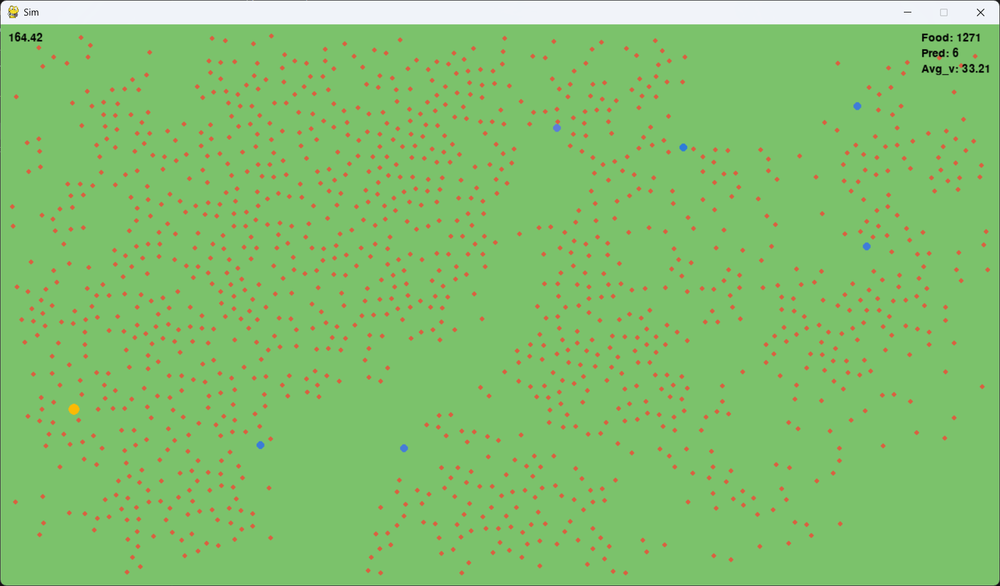

# Predator-Prey evolution simulator

## Overview
A Pygame-based simulation with predator and prey entities that are born, reproduce, and die. Predators can move and eat. All events are statistically described.



## How to Run
```cmd
python -m simulator.py
```
